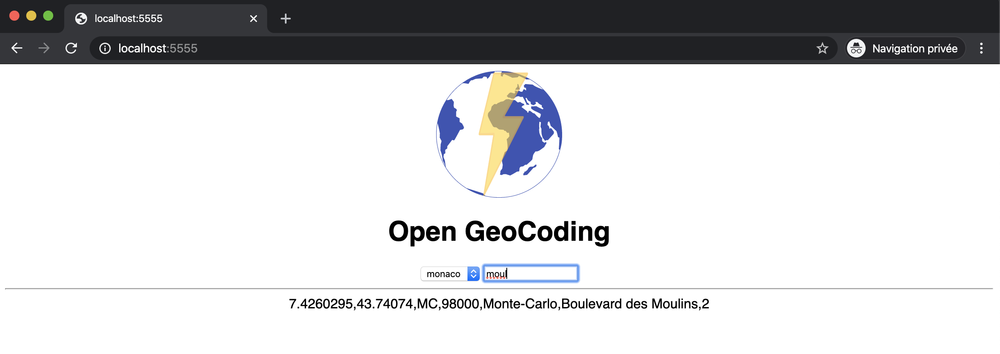

Open GeoCoding
==============

**Ultra fast fuzzy match address geocode resolution HTTP API.**

Based on open street map data, available at https://download.geofabrik.de/ indexed using ngrams.

Author: Sebastien Campion

Load data in memory 
--------------------

Using command line : 

    ./ogc -l monaco.csv -l belgium.csv 
    
Using HTTP, see load script for osm conversion : 

    curl --request POST   -F file=@monaco.csv http://localhost:5555/load

Run 
----

	./ogc -w
	

Query 
-----

    [0] % curl "http://localhost:5555/monaco?q=Moulins"
    {   
      "coord": [
        "7.4260295",
        "43.7407400"
      ],
      "query": "Moulins",
      "result": "('MC', '98000', 'Monte-Carlo', 'Boulevard des Moulins', '2')"
    }

